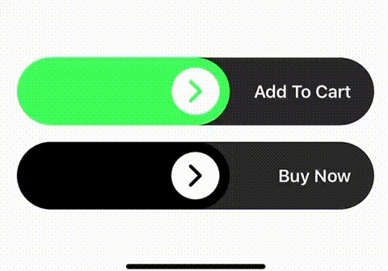

# Sliding Button

This is just an experimental UIKit widget, a button that you don't press, but you slide it in order to tap!

## Installation

Just copy the source code from [./SlidingButton/SlidingButton.swift](./SlidingButton/SlidingButton.swift) and download the arrow image that I [just found on google](https://www.onlinewebfonts.com/icon/231176)